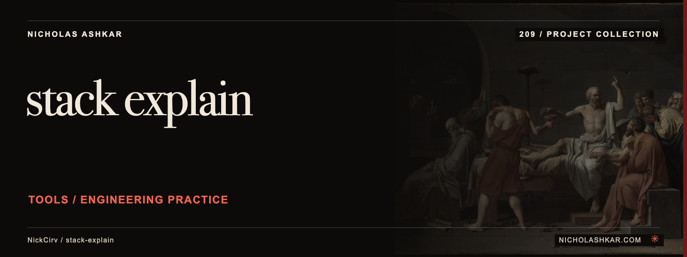

# stack-explain

Translate recognizable error messages into a local explanation and suggested next step.

The current implementation parses an error line and matches it against a bundled rule catalog. It accepts piped text, a log file or a quoted error message without an API call.


<a id="install"></a>

## Quickstart

Package runtime requirement: Node.js `>=20`. Git is needed to obtain this pinned source checkout.

```bash
git clone https://github.com/NickCirv/stack-explain.git
cd stack-explain
git checkout f85e4c9c676726b7ac97e5cc110d74e174a02a94
npm install --ignore-scripts
node bin/explain.js 'TypeError: x is not a function'
```

This source-derived example has not been executed in this review. The matching rule returns an explanation and suggested fix; the wording is local catalog output, not model-generated diagnosis.


<a id="what-it-explains"></a>

<a id="claude-ai-mode"></a>

## Usage

```bash
node bin/explain.js error.log
printf '%s\n' 'ENOENT: missing file' | node bin/explain.js
```

Piped input is preferred when present. If a positional value cannot be read as a file, it is treated as the error text.

[Command reference](docs/REFERENCE.md) covers arguments, modes and output controls.


<a id="what-it-is-not"></a>

## Behavior and limits

The old README’s `--ai`, `--lang` and `--file` interfaces are not implemented by this revision. Package dependencies still include an Anthropic SDK, but the inspected runtime path uses local rules only. Matching examines a bounded prefix and cannot diagnose the application’s actual state. Verify suggestions before applying them.


<a id="use-in-ci"></a>

## Development

Declared package scripts:

| Script | Command |
| --- | --- |
| `start` | `node bin/explain.js` |
| `test` | `node --test` |

The smoke test syntax-checks the entrypoint; it does not exercise CLI behavior or integrations.

## Research

[Source review and claim ledger](docs/RESEARCH.md) records revision `f85e4c9c6767`, inspected files and verification gaps.

## License and attribution

Protected license and attribution files remain unchanged: [LICENSE](https://github.com/NickCirv/stack-explain/blob/f85e4c9c676726b7ac97e5cc110d74e174a02a94/LICENSE).

[Artwork credits](assets/nicholas-ashkar/CREDITS.md) · [Nicholas Ashkar — consulting](https://nicholashkar.com/#oxblood-contact)
