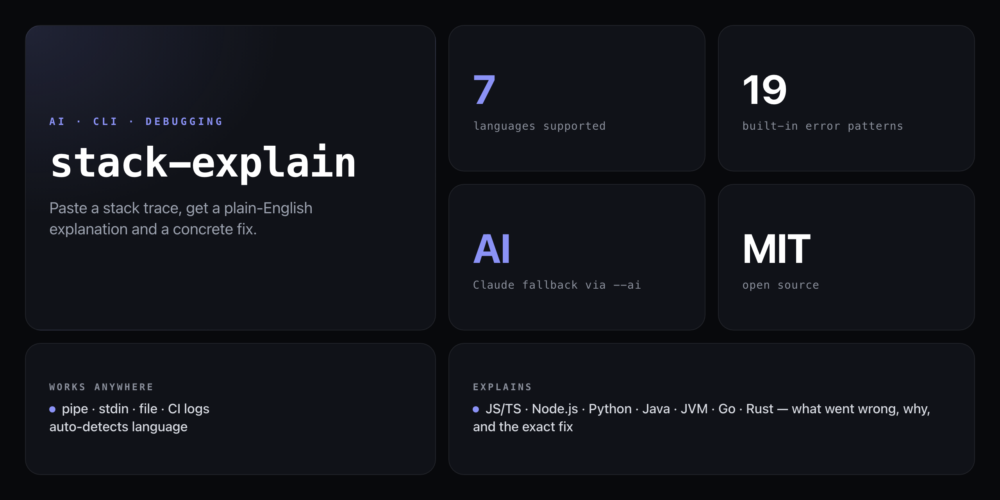

<div align="center">

**Turn unreadable stack traces into plain English — root cause, why it happened, and the exact fix.**


</div>

---

Stack traces are written for runtimes, not humans. `stack-explain` reads the trace, identifies the error class, and returns a plain-English explanation with a targeted fix. Works offline via built-in pattern matching for 19 common error types across 7 languages; optionally escalates to Claude AI for errors it doesn't recognise.

```
  stack-explain

  Error: TypeError: Cannot read properties of undefined (reading 'map')
  at UserList (/app/src/components/UserList.jsx:12:18)

  ────────────────────────────────────────────────────────────
  What happened
  You tried to access a property on undefined. The variable was
  never set — it's undefined when the code expects an object.

  Likely cause
  The `users` prop is undefined at the time the component renders.
  This is common when data hasn't loaded yet from an async fetch.

  Fix
  Add a null check before calling .map():
    if (!users) return null;
  Or use optional chaining:
    users?.map(...)
  Or provide a default value:
    const UserList = ({ users = [] }) => ...

  Source: local pattern match
```

## Install

No global install needed — run directly from GitHub:

```bash
npx github:NickCirv/stack-explain
```

## Usage

```bash
# Paste a stack trace interactively
npx github:NickCirv/stack-explain

# Pipe it in from a log file
cat error.log | npx github:NickCirv/stack-explain

# Read from a file
npx github:NickCirv/stack-explain --file crash.log

# Hint the language for faster matching
npx github:NickCirv/stack-explain --lang py

# Use Claude AI for unfamiliar errors
export ANTHROPIC_API_KEY=your-key
npx github:NickCirv/stack-explain --ai
```

| Flag | Description | Default |
|------|-------------|---------|
| `--ai` | Use Claude AI for errors outside built-in patterns (requires `ANTHROPIC_API_KEY`) | off |
| `--file <path>` | Read stack trace from a file instead of stdin | stdin |
| `--lang <language>` | Hint the language (`js`, `py`, `java`, `go`, `rust`) | auto-detected |

## What it explains

| Language | Error types |
|----------|-------------|
| **JavaScript / TypeScript** | `TypeError`, `ReferenceError`, `SyntaxError` |
| **Node.js** | `ENOENT`, `EACCES`, `ECONNREFUSED`, `ETIMEDOUT` |
| **Python** | `ModuleNotFoundError`, `ImportError`, `AttributeError`, `KeyError`, `IndexError` |
| **Java** | `NullPointerException`, `ClassCastException` |
| **JVM / Runtime** | `StackOverflowError`, `OutOfMemoryError` |
| **Go** | `panic: ...` |
| **Rust** | Thread panics, `unwrap()` failures |

## Claude AI mode

For errors that don't match built-in patterns, pass `--ai` and set your key:

```bash
export ANTHROPIC_API_KEY=your-key
npx github:NickCirv/stack-explain --ai
```

`stack-explain` falls back to the AI only when pattern matching returns no match — so common errors stay instant and offline.

## Use in CI

Pipe failing test output through `stack-explain` to get human-readable failure summaries in your CI logs:

```bash
npm test 2>&1 | npx github:NickCirv/stack-explain --file /dev/stdin
```

## What it is NOT

- **Not a debugger or profiler.** It explains what an error means and suggests a fix — it doesn't step through your code or measure performance.
- **Not a guarantee.** Pattern matching covers the 19 most common error classes. Novel or framework-specific errors may fall through to the generic fallback or AI mode.
- **Not a replacement for reading the docs.** The fix suggestions are a starting point. Deep bugs in your business logic still need your eyes on the code.

---

<div align="center">
<sub>Node 18+ · MIT · by <a href="https://github.com/NickCirv">NickCirv</a></sub>
</div>
